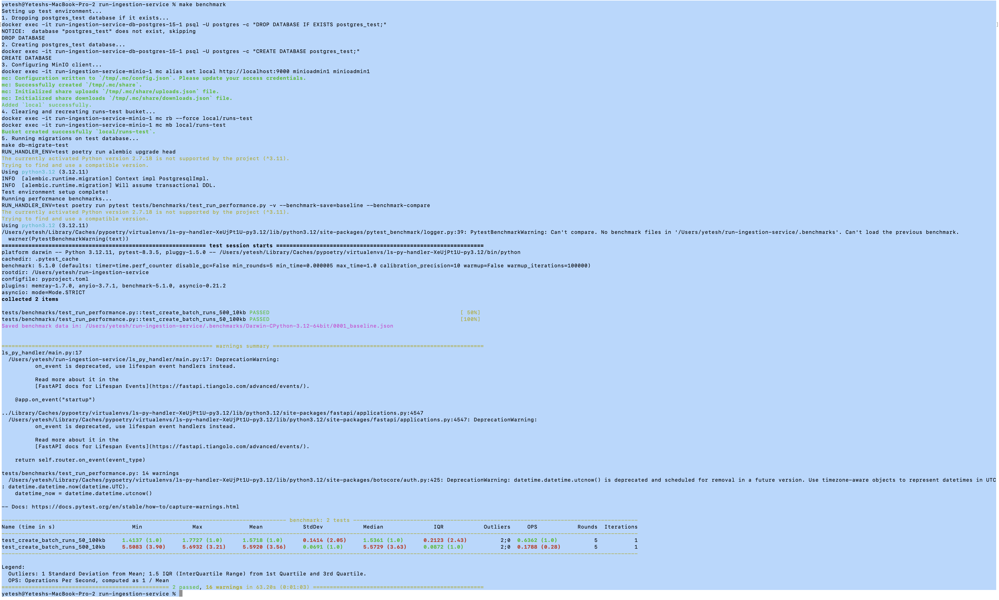

# ls-py-handler

A simple FastAPI server with endpoints for ingesting and fetching runs.

## Features

- `POST /runs` endpoint to create new runs
- `GET /runs/{id}` endpoint to retrieve run information by UUID

## Quick Start

```bash
# 1. Install dependencies
poetry install

# 2. Start database services (required before running the server)
make db-up

# 3. Run migrations and start the server
make server
```

The API will be available at http://localhost:8000

### Example API Usage

#### Creating Runs

```bash
# Create a new run
curl -X POST http://localhost:8000/runs \
  -H "Content-Type: application/json" \
  -d '[
    {
      "trace_id": "944ce838-b5c5-4628-8f23-089fbda8b9e3",
      "name": "Weather Query",
      "inputs": {"query": "What is the weather in San Francisco?"},
      "outputs": {"response": "It is currently 65°F and sunny in San Francisco."},
      "metadata": {"model": "gpt-4", "temperature": 0.7, "tokens": 42}
    }
  ]'
```

Response:
```json
{
  "ids": ["<generated-uuid>"]
}
```

#### Retrieving a Run

```bash
# Get a run by ID (replace <run-id> with an actual UUID)
curl -X GET http://localhost:8000/runs/<run-id>
```

Response:
```json
{
  "id": "<run-id>",
  "trace_id": "944ce838-b5c5-4628-8f23-089fbda8b9e3",
  "name": "Weather Query",
  "inputs": {"query": "What is the weather in San Francisco?"},
  "outputs": {"response": "It is currently 65°F and sunny in San Francisco."},
  "metadata": {"model": "gpt-4", "temperature": 0.7, "tokens": 42}
}
```

## Setup Details

This project uses Poetry for dependency management.

```bash
# Install dependencies
poetry install

# Activate the virtual environment
poetry shell
```

## Database Setup

This project uses PostgreSQL for data storage and MinIO for object storage. Docker Compose is used to manage these services.

```bash
# Start database services (PostgreSQL and MinIO)
make db-up

# Stop database services
make db-down

# Run database migrations
make db-migrate

# Revert the most recent migration
make db-downgrade
```

## Running the Server

```bash
# Start the server with migrations applied
make server

# Or manually start the server
poetry run uvicorn ls_py_handler.main:app --reload
```

## Linting and Formatting

This project uses Ruff for linting and formatting Python code.

```bash
# Format code
make format

# Check code for linting issues
make lint

# Automatically fix linting issues when possible
make lint-fix
```

## API Documentation

Once the server is running, you can access the auto-generated API documentation at:
- Swagger UI: http://localhost:8000/docs
- ReDoc: http://localhost:8000/redoc

## Testing

The project uses pytest for testing and includes a dedicated test environment configuration.

```bash
# Run tests (this automatically sets up the test environment)
make test
```

The test command will:
1. Set up a clean test environment (drop and recreate the test database and S3 bucket)
2. Run migrations on the test database
3. Execute all tests with the test environment settings

### Test Environment Setup

The test environment uses:
- A separate database (`postgres_test`)
- A separate S3 bucket (`runs-test`)
- Environment variables from `.env.test`

You can manually set up the test environment without running tests:

```bash
# Just set up the test environment
make test-setup
```

### Environment Configuration

The application uses environment-specific configuration:
- Development: Uses the default `.env` file
- Testing: Uses the `.env.test` file when `RUN_HANDLER_ENV=test` is set

This allows tests to run with isolated resources without affecting your development environment.

## Benchmarking and Profiling

The project includes tools for performance benchmarking and memory profiling to help identify bottlenecks and optimize resource usage.

### Performance Benchmarks

Performance benchmarks measure execution time of key operations using `pytest-benchmark`. The benchmarks are designed to isolate the API request handling time from data preparation and JSON serialization.

```bash
# Run performance benchmarks
make benchmark
```

This will:
1. Set up a clean test environment
2. Run the benchmark tests
3. Save the results to `.benchmarks` directory for comparison with future runs

Example benchmark scenarios:
- Processing 500 runs with 10KB of data per field
- Processing 50 runs with 100KB of data per field

### Memory Profiling

Memory profiling using `pytest-memray` helps identify memory usage.

```bash
# Run memory profiling
make memprofile
```

Memory profiling results will show:
- Peak memory usage for different operations
- Memory allocation patterns
- Memory-intensive functions and call paths


## Current Baseline

1. This is the output of running `make benchmark`:



2. This is the output of running `make memprofile`:

