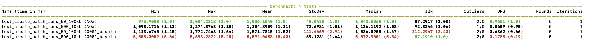
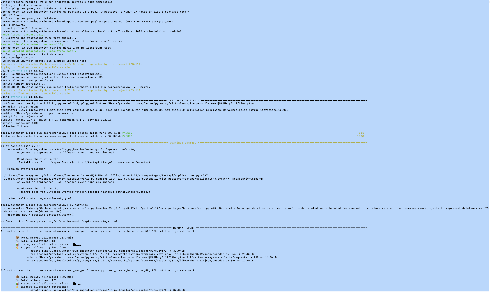
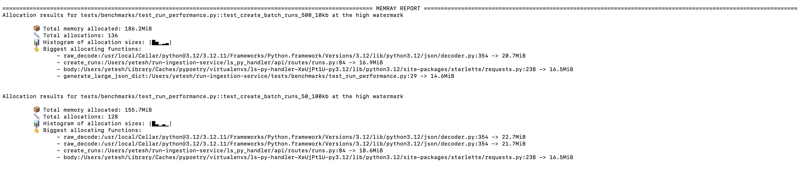

# Solution

This doc covers problems in terms of performance and scalability bottlenecks, proposed changes, implementation steps and results

## Problems

- JSON serialization & scanning: Entire batch of runs is serialized to memory, then Python `find` is used to locate field offsets (O(N * M) string scans).

- Sequential DB INSERTs: One INSERT per run inside a loop for `create_runs` call

- Multiple S3 GETs per run: Three separate S3 byte range requests for inputs/outputs/metadata fields

## Proposed changes

1. NDJSON + Run-Level Offsets

    - Switch from full JSON array to newline-delimited JSON (NDJSON), allowing simple stream writing.
    - Track run-level offsets instead of individual field offsets.
    - Store in PostgreSQL:  s3_bucket, s3_key, start_offset, end_offset per run.
    - On retrieval: single S3 range GET to fetch only that run’s JSON, parse once.

2. Batched DB Writes

    Use asyncpg.copy_records_to_table or executemany() to batch-insert runs in one postgres call

3. Remove parsing and multiple S3 fetch calls

    Perform one S3 get_object byte range query to fetch bytes for the run details

## Implementation steps

1. Create migration to alter runs table:

    - Add columns: s3_bucket TEXT, s3_key TEXT, start_offset BIGINT, end_offset BIGINT.
    - Remove or deprecate inputs, outputs, metadata columns.

2. Refactor create_runs:

    - Change serialization from list → NDJSON stream.
    - Track run start/end offsets in bytes while writing.
    - Build a list of tuples (id, trace_id, name, bucket, key, start_offset, end_offset).
    - Use copy_records_to_table('runs', records, columns=...).
    - Single await s3.put_object(...) with full NDJSON.

3. Refactor get_run:

    - Query for s3_bucket, s3_key, start_offset, end_offset.
    - Perform one S3 get_object(Range=...) to fetch run object bytes.
    - orjson.loads bytes → run_dict → return.

4. Benchmark & Validate:

    Re-run `make benchmark` and `make memoryprofile` and compare improvements.

## Results

1. The benchmark for time improvements is as follows:
    - For a batch of 50 runs each with 100KB of payload
        - From max of 1.77s to max of 1.08s 
    - For a batch of 500 runs each with 10KB of payload
        - From max of 5.69s to max of 1.27s

2. The benchmark for memory are as follows:
    - For a batch of 50 runs each with 100KB of payload
        - The overall memory decreased from 162MB to 155MB
        - The run.py file memory reduced from 32MB to 16MB
    - For a batch of 500 runs each with 10KB of payload
        - The overall memory decreased from 217.9MB to 186.2MB
        - The run.py file memory reduced from 32MB to 18MB 

## Further improvements

- For read heavy use-case, we can cache hot runs in Redis.
- We can leverage CloudFront in front of MinIO/S3 for global distribution.
- We incur client instantiation overhead by creating a new aiobotocore client per create_runs and per each fetch_from_s3 call. Instead, we can reuse S3 Client by creating a singleton aiobotocore client on app startup and reuse across requests. We can move get_s3_client to FastAPI startup event, store in app state and use app.state.s3_client in dependencies.
- If we need to shard the Postgres DB in case of high traffic, we can implement that.